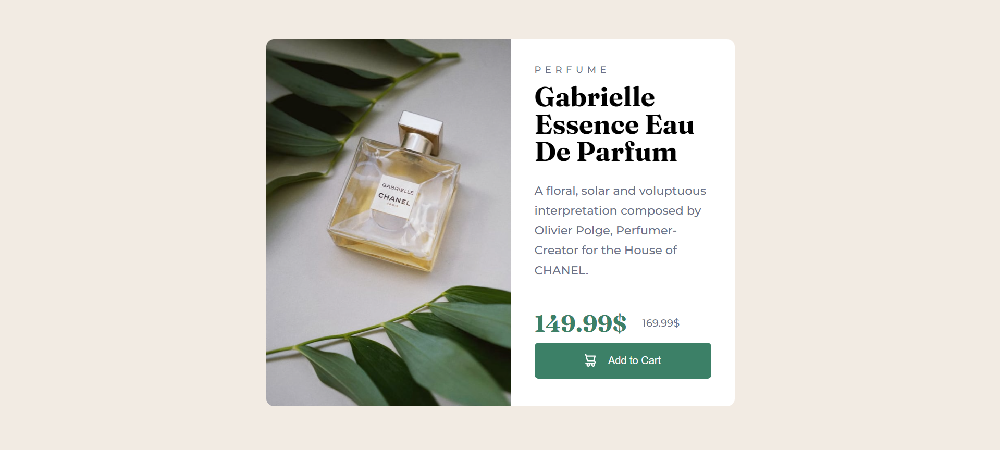
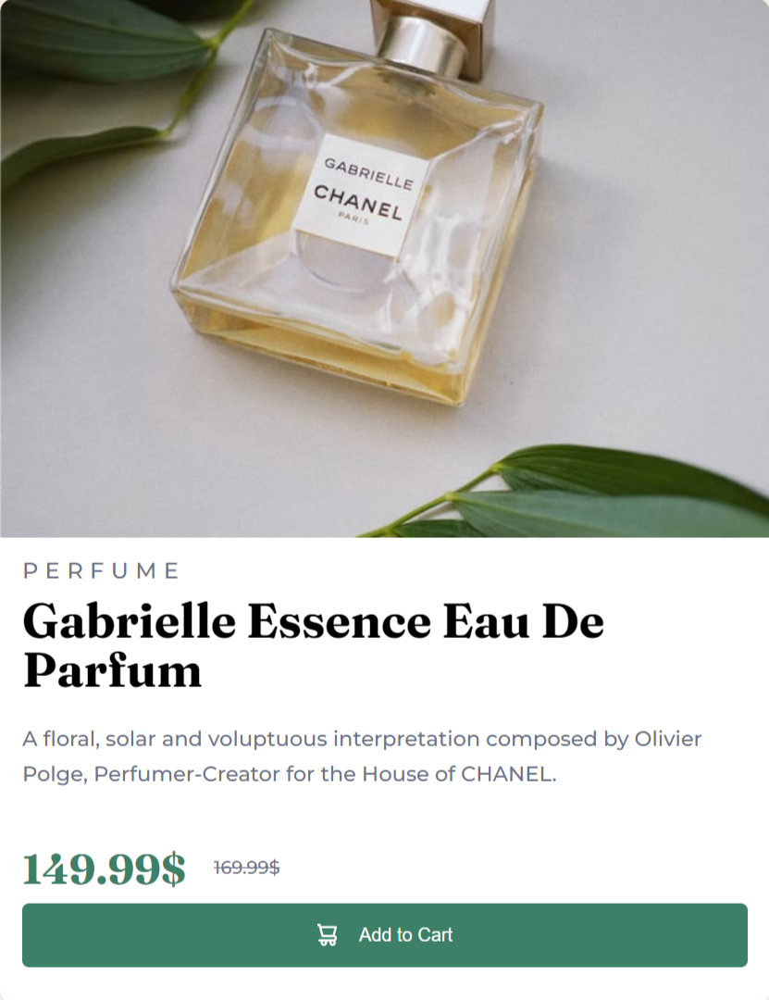

# Frontend Mentor - Product preview card component solution

This is a solution to the [Product preview card component challenge on Frontend Mentor](https://www.frontendmentor.io/challenges/product-preview-card-component-GO7UmttRfa). Frontend Mentor challenges help you improve your coding skills by building realistic projects. 

## Table of contents

- [Overview](#overview)
  - [The challenge](#the-challenge)
  - [Screenshot](#screenshot)
  - [Links](#links)
- [My process](#my-process)
  - [Built with](#built-with)
  - [What I learned](#what-i-learned)
  - [Continued development](#continued-development)
  - [Useful resources](#useful-resources)
- [Author](#author)


## Overview

### The challenge

Users should be able to:

- View the optimal layout depending on their device's screen size
- See hover and focus states for interactive elements

### Screenshot






### Links

- Solution URL: [Add solution URL here](https://your-solution-url.com)
- Live Site URL: [https://sumayyahsayyed.github.io/Frontend-Mentor-1/]

## My process

### Built with

- Semantic HTML5 markup
- CSS custom properties
- Flexbox
- Mobile-first workflow

### What I learned

I learned that you can use hide elements completely by setting display to none. 


```html


```
```css
.image1 {
    width: 100%;
    border-top-left-radius: 10px;
    border-top-right-radius: 10px;
    box-sizing: border-box;

    margin: 0;
    padding: 0;
    display: block;
}

.image2 {
    display: none;
}
```

### Continued development

I want to focus on flexbox.

### Useful resources

- [Example resource 1](https://stackoverflow.com/questions/3947113/space-between-div-and-img) - This helped me to remove extra space between an image and a div.

## Author

- Frontend Mentor - [@SumayyahSayyed](https://www.frontendmentor.io/profile/SumayyahSayyed)
- Twitter - [@sumayyah_sayyed](https://twitter.com/sumayyah_sayyed)

